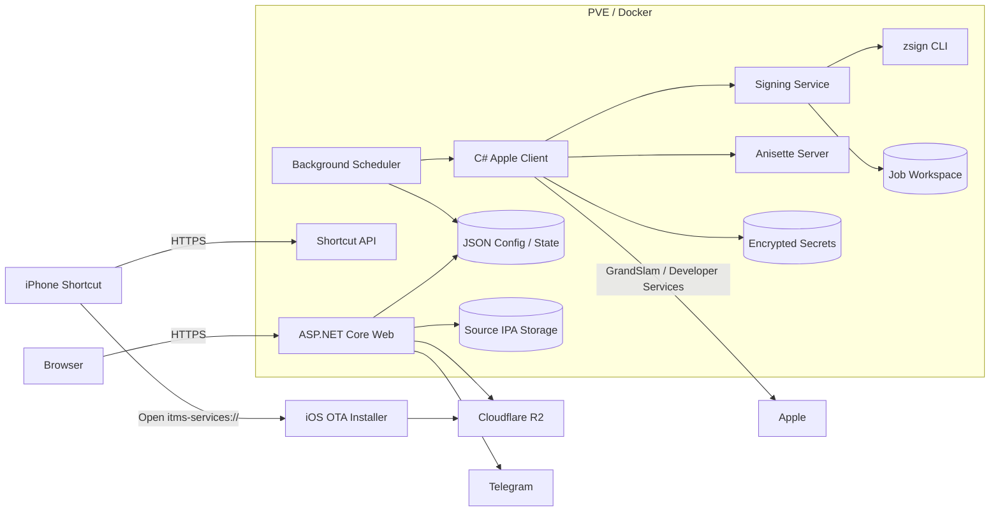
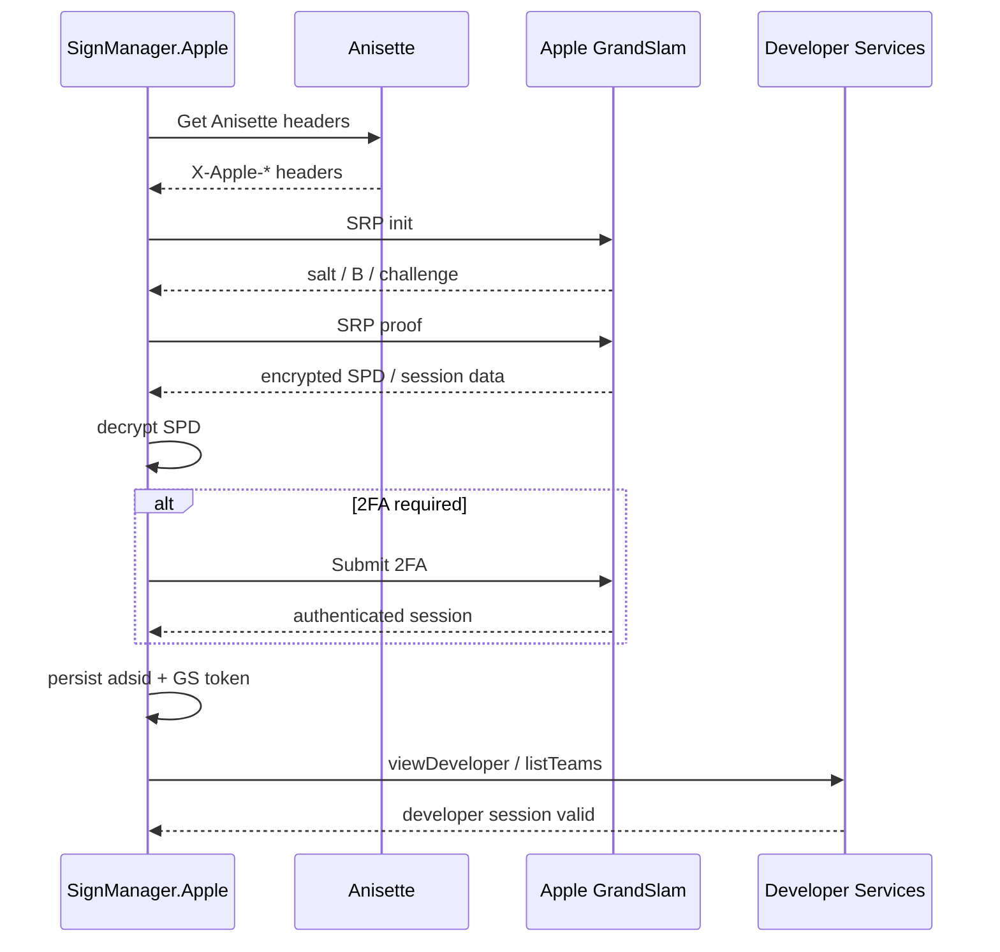
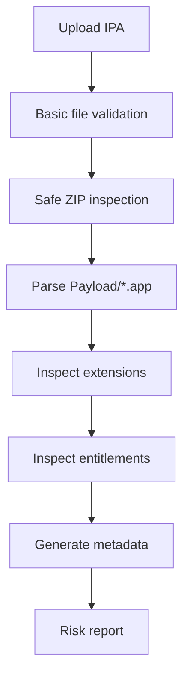
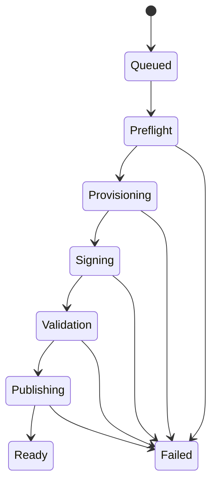
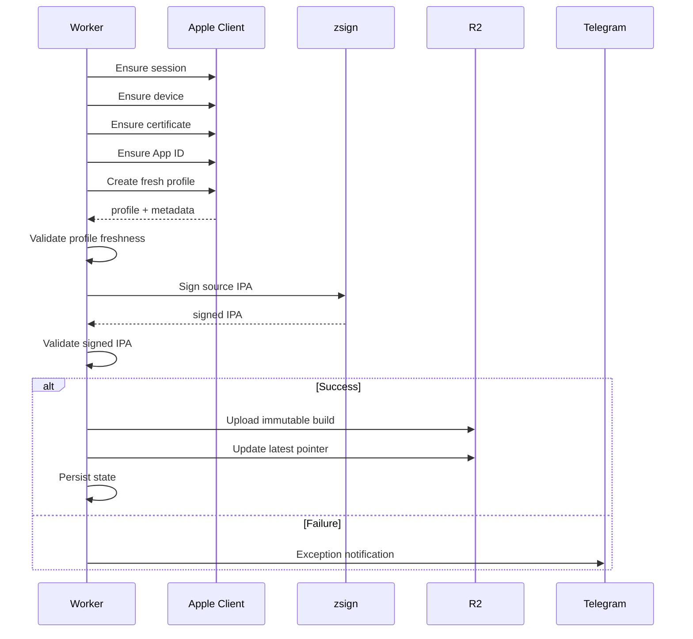
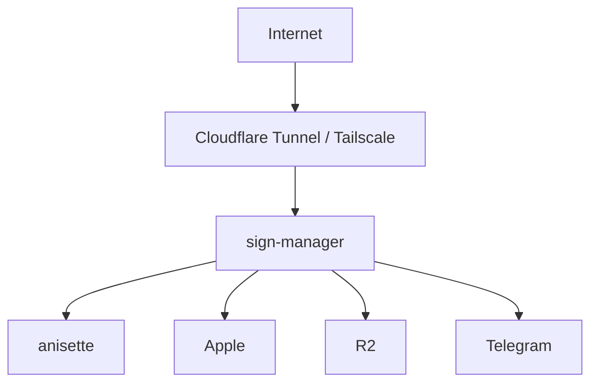
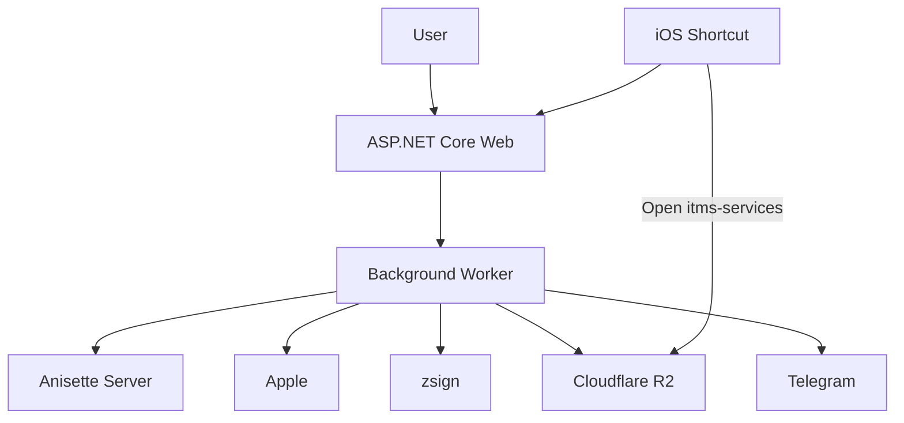

# Self-hosted iOS Signing & OTA Update Platform
## C# Native Apple Provisioning + zsign + Anisette 開發計畫

> 本文件取代先前以 Splice fork 為核心的開發計畫。
>
> 新方案**不 fork、不部署、不執行 Splice**。Splice 僅作為 Apple authentication / Developer Services protocol 的 reference implementation。
>
> 正式系統採：
>
> - **C# / ASP.NET Core**：Web、Scheduler、Apple Login、Developer Services、Provisioning、R2、Telegram、Shortcut API
> - **zsign**：IPA / Mach-O 實際 code signing
> - **獨立 Anisette Server**：提供 Apple authentication 所需 Anisette headers
> - **Cloudflare R2**：OTA artifacts
> - **iOS 捷徑自動化**：在使用者醒著且操作手機時觸發更新檢查
>
> 最終目標：
>
> ```text
> Server side = unattended
> iPhone side = 只保留 iOS 系統要求的最後一次 Install confirmation
> Operations = exception-only
> ```

---

# 1. 專案目標

建立一套可在 PVE / Docker Linux 環境執行的自架 iOS Personal Team signing platform。

核心用途：

- 管理少量 IPA（目前約 2 個，設計上符合 Personal Team 少量 App 的限制）
- 每 48 小時自動取得新的 provisioning profile
- 使用固定 bundle identity 重新簽名
- 發佈至 Cloudflare R2
- 提供 OTA `itms-services://` 安裝
- 使用 iOS 捷徑在「停止起床鬧鐘 / 拔除充電器」時自動檢查
- 平常不發通知
- 只有 Apple session 過期、簽名失敗、R2 失敗等異常才 Telegram 通知

---

# 2. Non-goals

MVP 不做：

```text
Splice fork
Splice runtime dependency
MDM
Supervision
Silent iOS install
Paid Apple Developer Program
App Store distribution
Database
Redis
RabbitMQ
Hangfire
Kubernetes
multi-user SaaS
GitHub Actions signing
macOS build farm
iOS source compilation
```

如果來源是 Swift / Xcode source code，仍需要 macOS + Xcode 先 build IPA。

本系統只處理：

```text
existing IPA
    ↓
Apple provisioning
    ↓
sign
    ↓
publish
    ↓
OTA refresh
```

---

# 3. 為什麼不再 fork Splice

Splice 在本專案中只作為 protocol reference。

不直接採用 Splice 的原因：

1. 主要程式語言為 D，後續維護成本高。
2. 專案更新頻率不高，保留 upstream merge 能力的價值有限。
3. 本專案只需要 Splice 很小一部分能力：Apple account authentication、2FA、Developer Services、Device / App ID / Certificate / Provisioning。
4. 不需要 USB install、Wi-Fi install、refresh daemon、AltStore source、tweak、TrollStore、JIT、device discovery、CLI UI。
5. 先前 security review 已發現數個不適合直接放進 long-running server 的攻擊面。
6. 使用 C# 可讓大部分系統共用同一種語言、同一套 logging / testing / configuration。

策略：

```text
Splice
    ↓
Reference implementation only

我們自己實作
    ↓
C# Apple protocol client
```

---

# 4. 第三方元件責任

## 4.1 zsign

zsign 負責：

```text
IPA unpack/repack
Mach-O code signing
CodeDirectory
CMS signature
CodeResources
embedded.mobileprovision
entitlements
Framework signing
App Extension signing
Bundle ID replacement
extension removal
```

輸入：

```text
source.ipa
certificate / private key
.mobileprovision
effective bundle id
```

輸出：

```text
signed.ipa
```

**不要自行重寫 Mach-O signer。**

## 4.2 Anisette Server

Anisette Server 負責提供 Apple authentication 所需 headers，例如：

```text
X-Apple-I-MD
X-Apple-I-MD-M
X-Apple-I-MD-LU
X-Mme-Device-Id
X-Mme-Client-Info
```

正式系統只實作 **Remote Anisette Provider**，不實作 Local ADI，因此完全移除：

```text
Apple Music APK
libCoreADI.so
libstoreservicescore.so
local Android ADI emulation
```

## 4.3 Splice

Splice 不參與 runtime，只用於：

```text
讀 source
理解 Apple protocol
對照 request/response behavior
驗證 C# implementation
```

不要：

```text
COPY splice binary
引用 splice library
直接呼叫 splice CLI
把 splice source 搬進正式 repo
```

---

# 5. 高階架構



---

# 6. Repo 結構

只需要一個 repo：

```text
ios-sign-manager/
│
├─ src/
│  ├─ SignManager.Web/
│  ├─ SignManager.Worker/
│  ├─ SignManager.Core/
│  ├─ SignManager.Apple/
│  ├─ SignManager.Signing/
│  └─ SignManager.Infrastructure/
│
├─ tests/
│  ├─ SignManager.Core.Tests/
│  ├─ SignManager.Apple.Tests/
│  ├─ SignManager.Signing.Tests/
│  └─ SignManager.IntegrationTests/
│
├─ docker/
│  ├─ Dockerfile
│  └─ docker-compose.yml
│
├─ docs/
│  ├─ protocol-notes/
│  └─ deployment.md
│
├─ .env.example
├─ README.md
└─ ios-sign-manager.sln
```

---

# 7. Project Responsibilities

## `SignManager.Core`

只放 domain model / pure logic：

```text
AppConfig
AppState
SigningJob
BuildInfo
ProvisioningInfo
RefreshPlan
RetryPolicy
BundleIdentity
ProfileFreshnessPolicy
```

不得直接依賴 ASP.NET、R2、Telegram、HttpClient 或 filesystem。

## `SignManager.Apple`

負責：

```text
Apple authentication
SRP
2FA
session restore
Developer Services
Team
Device
Certificate
App ID
Provisioning Profile
Anisette client
```

## `SignManager.Signing`

負責：

```text
IPA preflight
safe IPA inspection
bundle mapping
extension policy
zsign process invocation
signed IPA validation
manifest metadata extraction
```

## `SignManager.Infrastructure`

負責：

```text
JSON persistence
filesystem
R2
Telegram
encryption
process runner
clock abstraction
hashing
```

## `SignManager.Worker`

負責 scheduler、signing jobs、retry、publishing、cleanup、exception notification。

MVP 可與 Web 同 process；如果之後要強化 secret isolation，再拆成獨立 container。

## `SignManager.Web`

負責 Razor Pages、Web API、Shortcut API、App management、Sign Now、Replace IPA、Install link、Apple account status。

---

# 8. Apple Authentication

Apple login 是整個自研部分中最重要、也是最難的模組。



---

# 9. Authentication Design

## 9.1 Default credential mode：token-only

第一次 login：

```text
Apple ID
Password
2FA
    ↓
GrandSlam
    ↓
adsid + GS token
    ↓
encrypted persistence
```

Password 只存在 process memory，成功後不保存。

Token 失效：

```text
AUTH_REQUIRED
```

Worker 行為：停止 signing retry、Telegram 通知、Web 顯示 Auth Required。

## 9.2 Encrypted Secret Store

不要使用 plaintext JSON 或 environment variable 儲存長期 token。

使用：

```text
/signing-state/secrets.enc
```

Master key：

```text
/run/secrets/signmanager_master_key
```

建議：AES-256-GCM + 32-byte random master key + versioned envelope format。

---

# 10. SRP / GrandSlam 實作策略

不要直接逐行翻譯 Splice。

1. 先整理 protocol notes。
2. 建立 deterministic test fixtures。
3. 將 cryptographic calculations 分成 pure functions。
4. 所有 byte-level input/output 建 regression tests。
5. 使用 Splice 作 behavioral oracle，不把 source 直接搬進正式 implementation。

建議類別：

```text
AppleGrandSlamClient
AppleSrpSession
AppleSrpParameters
AppleSessionCrypto
AppleTwoFactorClient
AppleSession
```

---

# 11. Anisette Client

```csharp
public interface IAnisetteProvider
{
    Task<AnisetteHeaders> GetHeadersAsync(
        CancellationToken cancellationToken);
}
```

HTTP implementation：`HttpAnisetteProvider`。

要求：

```text
HTTPS or Docker-private network
timeout
retry with backoff
response schema validation
required headers validation
no credential forwarding
```

Anisette server 不應收到 Apple password、GS token、Developer certificate、private key 或 IPA。

---

# 12. Developer Services

提供 domain-specific client，不做 generic Apple SDK。

```csharp
public interface IAppleDeveloperClient
{
    Task<IReadOnlyList<DeveloperTeam>> GetTeamsAsync(...);

    Task<RegisteredDevice> EnsureDeviceAsync(
        string teamId,
        string udid,
        string deviceName,
        ...);

    Task<DevelopmentCertificate> EnsureCertificateAsync(
        string teamId,
        ...);

    Task<AppIdentifier> EnsureAppIdAsync(
        string teamId,
        string bundleId,
        ...);

    Task<ProvisioningProfile> CreateProvisioningProfileAsync(
        string teamId,
        string appIdId,
        string deviceId,
        ...);
}
```

主要 endpoint 類型：

```text
listTeams
listDevices
addDevice
listCertificates
submitDevelopmentCSR
listAppIds
addAppId
create/download provisioning profile
```

---

# 13. Device Management

目標 iPhone 不需要在 signing 時連接 PVE。

Web 設定一次：

```json
{
  "device": {
    "name": "Eddie iPhone",
    "udid": "000081..."
  }
}
```

第一次 provisioning 執行 `EnsureDevice`；已存在就 reuse，不存在才 register。

---

# 14. Certificate Management

使用 C# 原生 crypto：

```text
RSA 2048
PKCS#10 CSR
Apple Developer Services
Development certificate
```

可使用：

```csharp
RSA.Create(2048)
CertificateRequest
```

Private key 使用 encrypted PKCS#8，檔案 permission `0600`。

Certificate reuse policy：只要 valid 就 reuse，**不要每 48 小時重建 certificate**。

---

# 15. App ID Management

每個 App 必須使用 deterministic identity：

```text
com.eddie.sideload.qrscanner
com.eddie.sideload.youtube
```

禁止：

```text
com.eddie.sideload.youtube.20260905
```

App ID strategy：`EnsureAppId(bundleId)`，不存在才建立。

---

# 16. Extension Policy

第三方 IPA 可能含：

```text
PlugIns/*.appex
Watch/
AppClips/
```

MVP 預設：

```text
Remove Extensions = true
```

UI 要顯示 Main App IDs、Extensions、Estimated total App IDs used。

只有使用者明確需要 extension 時才保留。

---

# 17. Provisioning Profile Renewal

這是整個系統的核心條件。

每次 auto-sign 必須取得 fresh profile。

成功條件：

```text
CreationDate > previous CreationDate
ExpirationDate > previous ExpirationDate
ExpirationDate >= now + MinimumFreshHours
```

建議：

```text
MinimumFreshHours = 144
```

任何 profile freshness check 失敗：

```text
PROFILE_NOT_FRESH
do not publish
```

---

# 18. zsign Integration

正式系統以外部 CLI 呼叫。

不要 P/Invoke zsign internals、fork zsign、vendor source 進 application code。

Docker build 時：

```text
clone zsign at pinned commit
build
COPY binary to final image
```

不要直接追 `master/latest`。

---

# 19. zsign Invocation

所有 process arguments 使用 `ProcessStartInfo.ArgumentList`，禁止 shell 拼接。

概念：

```text
zsign
  -k private-key.pem
  -c certificate.pem
  -m app.mobileprovision
  -b com.eddie.sideload.qrscanner
  -o output.ipa
  source.ipa
```

第三方 app 可使用 `-E` 移除 extensions。

Process safety：timeout、stdout/stderr size limit、timeout 時 kill process tree、exit code validation、output existence validation、SHA-256、isolated temporary workspace。

---

# 20. IPA Preflight

任何 upload 都視為 untrusted。



要求：

```text
only one main Payload/*.app
reject path traversal
reject absolute entries
reject symlinks
max entries
max expanded bytes
max single entry
max compression ratio
max upload bytes
```

建議預設：

```text
MaxUploadBytes = 2 GB
MaxEntries = 50_000
MaxTotalExpandedBytes = 4 GB
MaxSingleEntryBytes = 1 GB
MaxCompressionRatio = 200
```

---

# 21. App Metadata

Preflight 取得：Name、Source Bundle ID、Version、Build、Minimum iOS、IPA size、Extensions、Watch app、App Clips、Entitlements、Icon。

範例：

```json
{
  "name": "Example",
  "sourceBundleId": "com.vendor.example",
  "version": "1.2.3",
  "build": "100",
  "minimumOsVersion": "15.0",
  "extensions": [],
  "entitlements": [],
  "warnings": []
}
```

---

# 22. App Config

`apps.json`

```json
{
  "version": 1,
  "apps": [
    {
      "id": "qr-scanner",
      "name": "QR Scanner",
      "enabled": true,
      "source": {
        "path": "/data/sources/qr-scanner/source.ipa",
        "sha256": "...",
        "uploadedAt": "2026-09-06T00:00:00Z"
      },
      "identity": {
        "sourceBundleId": "com.vendor.qr",
        "effectiveBundleId": "com.eddie.sideload.qrscanner"
      },
      "signing": {
        "removeExtensions": true
      },
      "schedule": {
        "autoSign": true,
        "intervalHours": 48
      },
      "publish": {
        "slug": "qr-scanner"
      }
    }
  ]
}
```

---

# 23. Runtime State

`state.json`

```json
{
  "version": 1,
  "apps": {
    "qr-scanner": {
      "status": "ready",
      "lastSuccessfulSignAt": "2026-09-06T00:00:00Z",
      "nextSignDueAt": "2026-09-08T00:00:00Z",
      "latestBuildId": "20260906T000000Z",
      "profileCreationDate": "2026-09-06T00:00:00Z",
      "profileExpirationDate": "2026-09-13T00:00:00Z",
      "lastPromptAt": null,
      "lastError": null
    }
  }
}
```

JSON persistence：`SemaphoreSlim → serialize temp → Flush → close → atomic rename`，禁止直接覆寫原檔。

---

# 24. Filesystem

```text
/data/
├─ config/
│  ├─ apps.json
│  └─ settings.json
├─ state/
│  └─ state.json
├─ sources/
│  └─ <appId>/
│     └─ source.ipa
├─ jobs/
│  └─ <jobId>/
│     ├─ source.ipa
│     ├─ profile.mobileprovision
│     ├─ certificate.pem
│     ├─ output.ipa
│     └─ result.json
├─ builds/
│  └─ <appId>/
│     └─ <buildId>/
└─ logs/

/signing-state/
├─ secrets.enc
├─ private-key.pk8
├─ certificate.pem
└─ metadata.json
```

`source.ipa` 永遠 immutable。Replace IPA 只做新 upload → preflight → atomic replace。

每次 sign 必須從 source IPA 開始，禁止用上一次 signed IPA 再重簽。

---

# 25. Signing Job

```json
{
  "jobId": "uuid",
  "appId": "qr-scanner",
  "sourceSha256": "...",
  "type": "auto",
  "createdAt": "...",
  "status": "queued"
}
```



---

# 26. Scheduler

使用 `BackgroundService`，每 60 秒掃描一次。

Due condition：

```text
enabled
AND autoSign
AND now >= nextSignDueAt
AND app currently has no running job
```

Global signing concurrency：`1`。

Retry：

```text
Retry 1: 15 min
Retry 2: 1 hour
Retry 3: 4 hours
```

以下不 retry：

```text
AUTH_REQUIRED
APP_ID_QUOTA_EXCEEDED
UNSUPPORTED_ENTITLEMENT
INVALID_IPA
PROFILE_NOT_FRESH
```

直接 Telegram。

---

# 27. Signing Pipeline



---

# 28. Build Validation

zsign exit 0 還不代表可以 publish。

必須驗證：

```text
output exists
output size reasonable
output sha256
main bundle ID == expected
embedded profile exists
profile UUID == expected
profile ExpirationDate == expected
effective entitlements acceptable
```

任何 check 失敗：`do not publish`。

---

# 29. R2 Publishing

避免 predictable public path：

```text
/apps/<randomNamespace>/<appId>/builds/<buildId>/app.ipa
/apps/<randomNamespace>/<appId>/builds/<buildId>/manifest.plist
/apps/<randomNamespace>/<appId>/builds/<buildId>/build.json

/apps/<randomNamespace>/<appId>/latest/manifest.plist
/apps/<randomNamespace>/<appId>/latest/latest.json
```

`randomNamespace` 至少 128-bit random。

Publish order：

```text
1. upload versioned IPA
2. upload versioned manifest
3. upload versioned build.json
4. verify objects
5. update latest manifest
6. update latest.json
7. update local state
```

任何中途失敗，舊 latest 保持有效。

---

# 30. OTA Manifest

```xml
<?xml version="1.0" encoding="UTF-8"?>
<!DOCTYPE plist PUBLIC "-//Apple//DTD PLIST 1.0//EN"
  "http://www.apple.com/DTDs/PropertyList-1.0.dtd">
<plist version="1.0">
<dict>
  <key>items</key>
  <array>
    <dict>
      <key>assets</key>
      <array>
        <dict>
          <key>kind</key>
          <string>software-package</string>
          <key>url</key>
          <string>https://ios.example.com/.../app.ipa</string>
        </dict>
      </array>
      <key>metadata</key>
      <dict>
        <key>bundle-identifier</key>
        <string>com.eddie.sideload.qrscanner</string>
        <key>bundle-version</key>
        <string>100</string>
        <key>kind</key>
        <string>software</string>
        <key>title</key>
        <string>QR Scanner</string>
      </dict>
    </dict>
  </array>
</dict>
</plist>
```

Install URL：

```text
itms-services://?action=download-manifest&url=<encoded-manifest-url>
```

---

# 31. Web UI

使用 Razor Pages。

Dashboard：

```text
Apple Account
Session: Valid / Auth Required

Apps: 2 / 3

QR Scanner
Source: 1.1.0
Bundle ID: com.eddie.sideload.qrscanner
Last Sign: ...
Profile Expires: ...
Next Sign: ...
Status: Ready

[Install]
[Sign Now]
[Replace IPA]
[Settings]
```

Add App 顯示：Name、Version、Source Bundle ID、Effective Bundle ID、Extensions、Estimated App IDs used、Unsupported entitlements、Warnings。

Replace IPA 只更新 source file/hash/metadata，保留 app id、effective bundle ID、schedule、publish slug、shortcut state。

---

# 32. Apple Account UI

MVP 不提供 browser password form。

顯示：Apple ID（masked）、Team、Session status、Certificate status。

首次 login / session expired：

```text
docker compose exec sign-manager dotnet SignManager.Cli.dll apple login
```

CLI：

```text
Apple ID:
Password:
2FA:
```

成功後 password discarded、token encrypted。

---

# 33. Shortcut API

Authentication：

```text
Authorization: Bearer <device token>
```

Token：256-bit random、server 只存 hash、可 revoke。

## `GET /api/shortcut/refresh-plan`

```json
{
  "due": true,
  "app": {
    "id": "qr-scanner",
    "name": "QR Scanner",
    "buildId": "20260906T000000Z",
    "profileExpiresAt": "2026-09-13T00:00:00Z",
    "installUrl": "itms-services://?action=download-manifest&url=..."
  }
}
```

一次只回一個 App。

## `POST /api/shortcut/prompted`

```json
{
  "appId": "qr-scanner",
  "buildId": "20260906T000000Z"
}
```

這只表示捷徑準備開 OTA URL，不代表使用者真的按了 Install。

---

# 34. Shortcut Automation

共用 Shortcut：`Check Sideload Apps`

```text
GET refresh-plan
↓
due == false → End
↓
POST prompted
↓
Open URL
↓
itms-services://...
```

Personal Automation：

```text
A. Wake-up alarm stopped
B. Charger disconnected
```

兩者都呼叫同一 Shortcut。

MVP prompt policy：

```text
sign every 48h
prompt opportunity every ~72h per app
cooldown 12h
```

不要依賴 server 精確知道手機目前 installed build。

---

# 35. Telegram

正常成功：**不通知**。

只通知：

```text
AUTH_REQUIRED
signing failed after retry
R2 publish failed
profile not fresh
certificate failure
App ID quota exceeded
build nearing unsafe expiry window
```

禁止包含 Apple password、GS token、Anisette secret、private key、R2 secret、Shortcut bearer token。

---

# 36. Logging

Structured logging：

```text
timestamp
level
component
jobId
appId
event
duration
result
errorCode
```

禁止：

```text
raw GrandSlam payload
decrypted SPD
GS token
password
Authorization header
private key
Anisette secret headers
```

---

# 37. Docker Topology



MVP 一個 SignManager container 即可，內含 ASP.NET Core + BackgroundService + Apple client + zsign CLI。

Anisette 使用獨立 container。

---

# 38. Docker Hardening

SignManager：

```text
non-root UID
read_only root filesystem
no-new-privileges
cap_drop ALL
no docker.sock
no privileged
bounded /tmp
memory limit
pids limit
umask 077
```

Anisette：internal network only，不 publish public port；只有實作需要時才持久化 device state。

---

# 39. Backup / Cleanup

必備 backup：

```text
/data/config
/data/sources
/signing-state
```

可重建：

```text
/data/jobs
/data/builds
```

`/signing-state` backup 必須加密。

Cleanup：

```text
source IPA: 永久保留
job workspace: 24h
local builds: latest 3
R2 versioned build: 30 days 或 latest N
latest: 永久
```

---

# 40. Feasibility Gates

正式 Web UI 開發前，先完成 4 個 Spike。

## Spike A — Apple Login

目標：

```text
C# + Anisette
↓
Apple login
↓
2FA
↓
adsid + GS token
↓
viewDeveloper succeeds
```

Acceptance：不依賴 Splice binary、token 可 restore、重啟後不需 password。

## Spike B — Developer Provisioning

目標：

```text
GetTeams
EnsureDevice
Generate CSR
EnsureCertificate
EnsureAppId
CreateProfile
```

Acceptance：取得有效 `.mobileprovision`、profile 含 target UDID、bundle ID 正確、有效期符合 Personal Team 預期。

## Spike C — zsign

目標：

```text
source IPA
+
C# 取得的 cert/key/profile
↓
zsign
↓
signed IPA
```

Acceptance：signed IPA 可安裝、App 可啟動、bundle id 正確。

## Spike D — OTA + Shortcut

驗證：R2 manifest、`itms-services`、same bundle ID overwrite、Shortcut Open URL、Wake Alarm trigger、Charger trigger。

**四個 Spike 全部成功才開始完整 Web UI。**

---

# 41. Development Milestones

## Milestone 0 — Protocol Research

- [ ] 整理 Splice Apple auth behavior
- [ ] GrandSlam request/response notes
- [ ] 2FA notes
- [ ] Developer Services endpoint notes
- [ ] 建 test fixtures
- [ ] 確認 Anisette server interface

## Milestone 1 — Authentication Spike

- [ ] Anisette client
- [ ] SRP calculations
- [ ] GrandSlam client
- [ ] SPD decrypt
- [ ] 2FA
- [ ] session token
- [ ] encrypted token store
- [ ] token restore
- [ ] viewDeveloper validation

## Milestone 2 — Provisioning Spike

- [ ] list teams
- [ ] ensure device
- [ ] RSA + CSR
- [ ] ensure certificate
- [ ] ensure App ID
- [ ] create provisioning profile
- [ ] profile parser
- [ ] profile freshness validation

## Milestone 3 — Signing Spike

- [ ] pin zsign commit
- [ ] Docker build zsign
- [ ] process wrapper
- [ ] sign IPA
- [ ] bundle ID replacement
- [ ] remove extensions
- [ ] validate signed IPA

## Milestone 4 — OTA Spike

- [ ] R2 test path
- [ ] manifest generator
- [ ] `itms-services` URL
- [ ] real-device install
- [ ] overwrite existing app
- [ ] verify sandbox data persistence
- [ ] Shortcut trigger test

## Milestone 5 — Core Domain

- [ ] solution skeleton
- [ ] AppConfig
- [ ] AppState
- [ ] BuildInfo
- [ ] SigningJob
- [ ] JSON schema versioning
- [ ] atomic store

## Milestone 6 — IPA Management

- [ ] upload
- [ ] safe ZIP inspection
- [ ] metadata
- [ ] extension enumeration
- [ ] entitlement report
- [ ] Replace IPA
- [ ] source immutability

## Milestone 7 — Signing Worker

- [ ] end-to-end signing service
- [ ] single global semaphore
- [ ] job state
- [ ] retry policy
- [ ] failure codes
- [ ] build validation

## Milestone 8 — Scheduler

- [ ] 48h due calculation
- [ ] scan loop
- [ ] idempotency
- [ ] retry
- [ ] auth-required state
- [ ] manual Sign Now

## Milestone 9 — R2

- [ ] immutable path
- [ ] latest pointer
- [ ] manifest
- [ ] MIME
- [ ] partial failure handling
- [ ] cleanup

## Milestone 10 — Web UI

- [ ] dashboard
- [ ] app list
- [ ] add app
- [ ] replace IPA
- [ ] Sign Now
- [ ] Install
- [ ] Apple account status
- [ ] settings
- [ ] build history

## Milestone 11 — Shortcut API

- [ ] bearer token
- [ ] refresh-plan
- [ ] prompted
- [ ] cooldown
- [ ] priority policy
- [ ] Shortcut setup docs

## Milestone 12 — Operations

- [ ] Telegram exception alerts
- [ ] health checks
- [ ] structured logs
- [ ] backup
- [ ] restore test
- [ ] Docker hardening
- [ ] cleanup
- [ ] deployment docs

---

# 42. Stable Error Codes

```text
AUTH_REQUIRED
ANISSETTE_UNAVAILABLE
APPLE_LOGIN_FAILED
APPLE_2FA_REQUIRED
APPLE_2FA_FAILED
APPLE_SESSION_REJECTED

TEAM_NOT_FOUND
DEVICE_REGISTRATION_FAILED
CERTIFICATE_FAILED
APP_ID_QUOTA_EXCEEDED
APP_ID_CREATE_FAILED
PROFILE_CREATE_FAILED
PROFILE_NOT_FRESH

INVALID_IPA
UNSUPPORTED_ENTITLEMENT
ZIP_LIMIT_EXCEEDED
ZIP_PATH_TRAVERSAL
ZSIGN_FAILED
SIGNED_IPA_VALIDATION_FAILED

R2_UPLOAD_FAILED
MANIFEST_GENERATION_FAILED
TELEGRAM_FAILED
```

Web / Worker 不依賴 exception message 做邏輯判斷。

---

# 43. Testing Strategy

## Unit

Apple：SRP math、hash/HMAC、SPD decrypt、plist serialization、token store、profile parser。

Core：due calculation、retry、cooldown、idempotency、bundle mapping、profile freshness。

Signing：safe ZIP、path traversal、zip bomb、metadata、zsign argument construction、output validation。

## Integration

```text
fake Anisette
fake Apple HTTP
fake zsign executable
fake R2 S3
fake Telegram
```

## Live

使用 dedicated Apple Account：

```text
1. login
2. 2FA
3. token restore
4. register target UDID
5. create/reuse certificate
6. create App ID
7. create profile
8. sign IPA
9. OTA install
10. 48h later create new profile
11. OTA overwrite
12. invalidate session
13. verify AUTH_REQUIRED
14. verify Telegram
```

Security tests 必含 malicious IPA path traversal、zip bomb、symlink、oversized entry、malformed plist、multiple main apps、unsupported entitlement、R2 partial failure、Apple session expiry、Anisette unavailable、zsign timeout、manager restart mid-job、duplicate scheduler、Shortcut 重複呼叫。

---

# 44. Health

```text
GET /health/live
GET /health/ready
```

Ready 條件：JSON readable、data path writable、secret store decryptable、Anisette reachable、zsign executable available、R2 configured。

Apple session invalid 時 service 仍可 `ready`，但 account status = `AUTH_REQUIRED`，避免 orchestration 不斷 restart container。

---

# 45. Licensing

重要：

```text
zsign = MIT
Splice = GPLv3
```

正式 runtime 不包含 Splice。

但如果直接逐函式翻譯、逐行 port、大段改寫 Splice source，新 implementation 仍可能有 derivative-work / GPL 問題。

因此開發方式：

```text
protocol research
↓
behavior/spec notes
↓
independent C# implementation
```

如果未來決定整個專案本身採 GPLv3，限制會較少。

---

# 46. Codex 工作規則

1. 不一次完成整套系統。
2. 嚴格依 Milestone 順序。
3. 先做 4 個 Spike。
4. Spike 失敗時停止 feature work。
5. 不 fork Splice。
6. 不把 Splice binary 放入 production。
7. 不重新實作 Mach-O signing。
8. zsign 使用 pinned commit。
9. Anisette 使用獨立 server。
10. Apple password 不 persist。
11. Secret 不寫入 `apps.json` / `state.json`。
12. Raw auth payload 不 log。
13. 所有 process args 用 `ArgumentList`。
14. 不使用 shell concatenation。
15. 所有 IPA 視為 untrusted input。
16. 每次 sign 都從 immutable source IPA 開始。
17. Failed build 不得設為 latest。
18. Profile 不 fresh 不得 publish。
19. 所有 JSON schema 都有 `version`。
20. Background job 必須 idempotent。
21. 不加 DB / EF Core。
22. 新 dependency 前先說明用途。
23. 每個 protocol implementation 要有 fixture test。
24. Security-sensitive code 必須先有 test 再 refactor。
25. 每個 milestone 完成後更新 README / docs。

---

# 47. 建議 Commit 粒度

```text
chore: create sign manager solution

feat: add anisette client
feat: implement apple srp primitives
feat: implement grandslam authentication
feat: add apple two-factor authentication
feat: add encrypted apple session store
feat: restore apple session from token

feat: add developer services client
feat: add device registration
feat: add certificate provisioning
feat: add app id provisioning
feat: add provisioning profile creation
feat: validate provisioning profile freshness

build: add pinned zsign build
feat: add zsign process wrapper
feat: add ipa resign workflow
feat: add signed ipa validation

feat: add json app registry
feat: add atomic state persistence
feat: add ipa preflight
security: harden ipa zip inspection

feat: add signing scheduler
feat: add retry and idempotency
feat: add r2 publisher
feat: add ota manifest generation

feat: add dashboard
feat: add app upload and replace
feat: add sign now action
feat: add install action

feat: add shortcut refresh api
feat: add shortcut cooldown
feat: add telegram exception notifications

chore: harden docker runtime
test: add end-to-end signing workflow
```

---

# 48. 最終 UX

## 平常

```text
Server every 48h
    ↓
fresh provisioning profile
    ↓
zsign
    ↓
R2 publish
    ↓
無通知
```

## 使用者早上

```text
停止起床鬧鐘
    ↓
Shortcut 自動執行
    ↓
GET refresh-plan
    ↓
不需要更新 → 結束

需要更新
    ↓
Open itms-services
    ↓
iOS install prompt
    ↓
使用者按 Install
```

## 異常

```text
Apple token expired
Apple provisioning failed
zsign failed
R2 failed
profile not fresh
    ↓
Telegram
```

---

# 49. 最終架構總結



正式系統 dependency boundary：

```text
Own code:
    C# / ASP.NET Core

External:
    Anisette Server
    zsign

Reference only:
    Splice
```

這是本專案新的基準架構，取代先前所有以 Splice fork 為核心的開發計畫。
